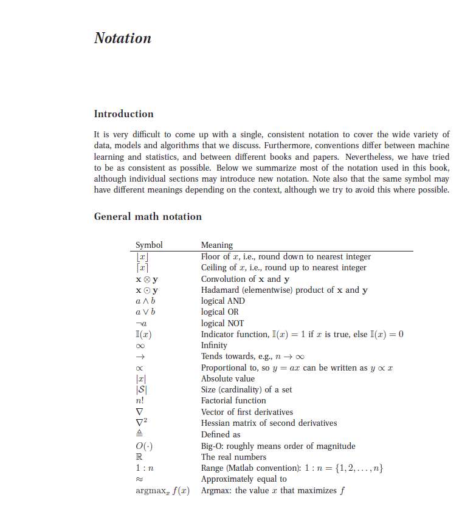
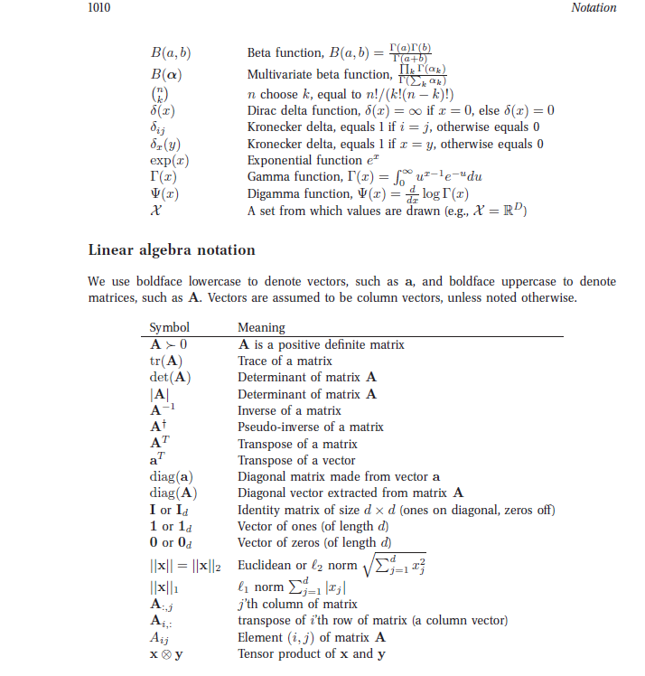
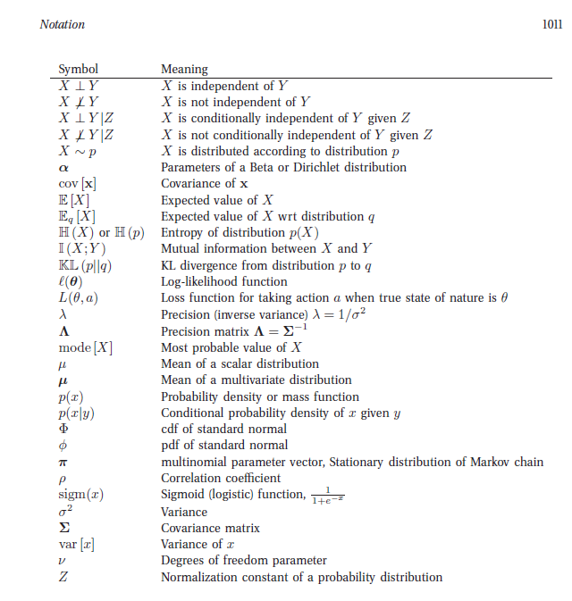
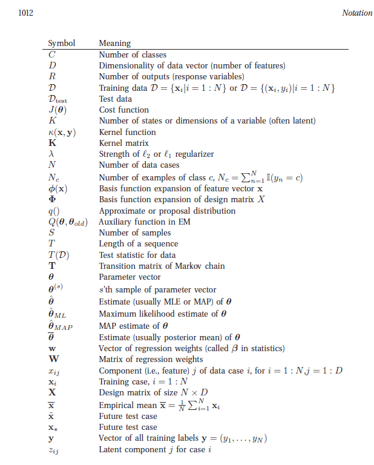
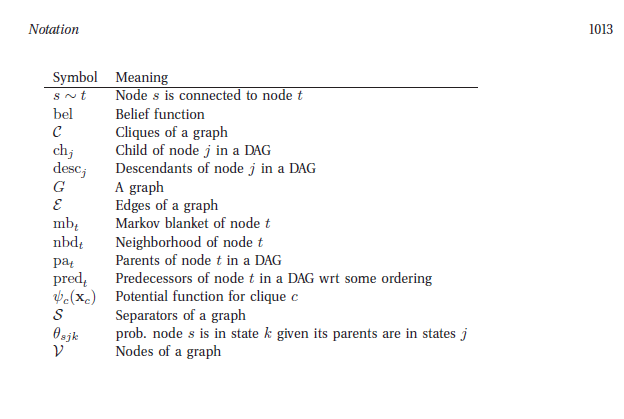

Notations
---

---

---

---
Machine learning/statistics notation
---

In general, we use upper case letters to denote constants, such as C, D, K, N, S, T, etc. We
use lower case letters as dummy indexes of the appropriate range, such as c = 1 : C to index
classes, j = 1 : D to index input features, k = 1 : K to index states or clusters, s = 1 : S to
index samples, t = 1 : T to index time, etc. To index data cases, we use the notation i = 1 : N,
although the notation n = 1 : N is also widely used.
We use x to represent an observed data vector. In a supervised problem, we use y or y to
represent the desired output label. We use z to represent a hidden variable. Sometimes we also
use q to represent a hidden discrete variable.

---

Graphical model notation
---

In graphical models, we index nodes by s, t, u ∈ V, and states by i, j, k ∈ X.

---

List of commonly used abbreviations

---

Abbreviation | Meaning
------------- |------
cdf    |Cumulative distribution function
CPD    |Conditional probability distribution
CPT    |Conditional probability table
CRF    |Conditional random field
DAG    |Directed acyclic graphic
DGM    |Directed graphical model
EB     |Empirical Bayes
EM     |Expectation maximization algorithm
EP     |Expectation propagation
GLM    |Generalized linear model
GMM    |Gaussian mixture model
HMM    |Hidden Markov model
iid    |Independent and identically distributed
iff    |If and only if
KL     |Kullback Leibler divergence
LDS    |Linear dynamical system
LHS    |Left hand side (of an equation)
MAP    |Maximum A Posterior estimate
MCMC   |Markov chain Monte Carlo
MH     |Metropolis Hastings
MLE    |Maximum likelihood estimate
MPM    |Maximum of Posterior Marginals
MRF    |Markov random field
MSE    |Mean squared error
NLL    |Negative log likelihood
OLS    |Ordinary least squares
pd     |Positive definite (matrix)
pdf    |Probability density function
pmf    |Probability mass function
RBPF   |Rao-Blackwellised particle filter
RHS    |Right hand side (of an equation)
RJMCMC |Reversible jump MCMC
RSS    |Residual sum of squares
SLDS   |Switching linear dynamical system
SSE    |Sum of squared errors
UGM    |Undirected graphical model
VB     |Variational Bayes
wrt    |With respect to